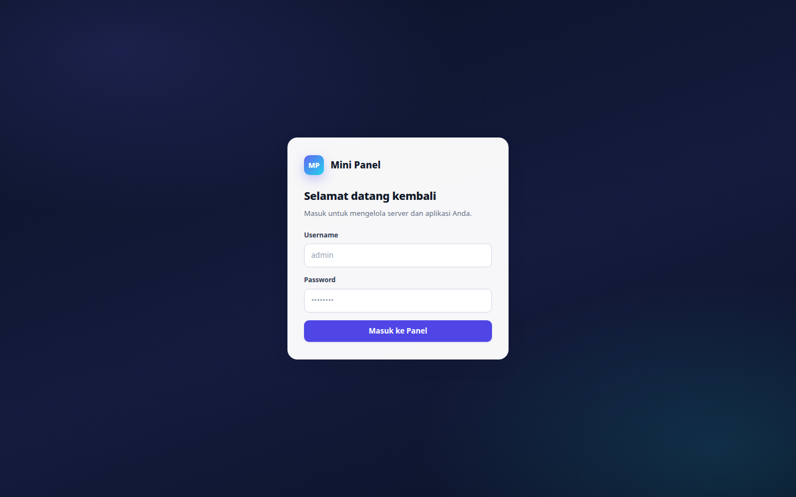
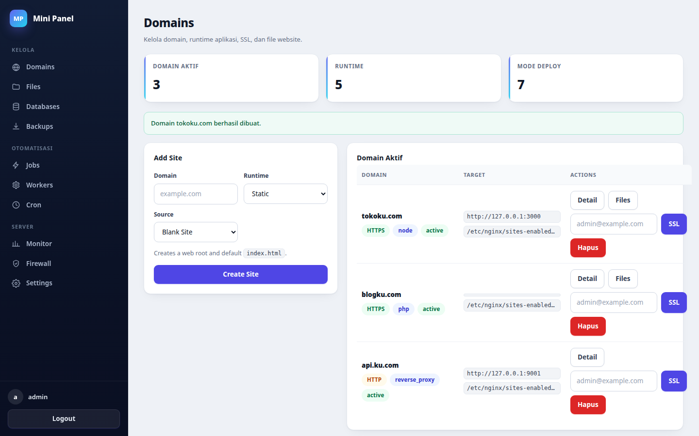
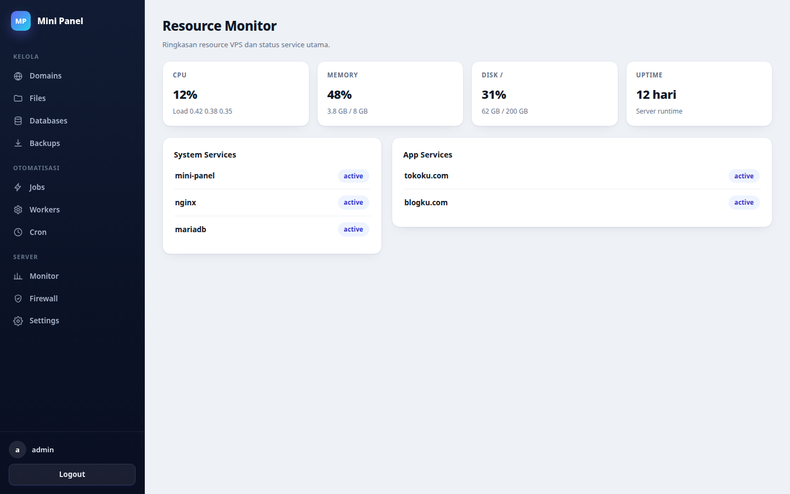

# Mini Panel

A small Go control panel for an Ubuntu VPS. The MVP supports admin login,
SQLite persistence, and Nginx reverse-proxy domain add/delete through an
allowlisted privileged helper script.

## Screenshots







## Highlights

- Modern dark-sidebar admin UI with grouped navigation (Kelola, Otomatisasi,
  Server), responsive layout, and mobile drawer menu.
- Hardened login: rate limiting (5 failed attempts / 10 min), bcrypt
  passwords (min 12 chars), HMAC-signed sessions, CSRF on all state-changing
  routes, and strict Content Security Policy.
- Release tarballs are SHA-256 checksum-verified during install.

## Local Development

```bash
go test ./...
mkdir -p .dev
go run ./cmd/mini-panel create-admin -db .dev/mini-panel.db -username admin -password 'change-this-long-password'
go run ./cmd/mini-panel serve -db .dev/mini-panel.db -addr 127.0.0.1:8080 -sudo=false -domainctl /path/to/fake-domainctl
```

Production install notes are in [docs/ubuntu-install.md](docs/ubuntu-install.md).

## One-shot Ubuntu Install

Create a GitHub release first so the VPS downloads a prebuilt binary instead
of compiling from source:

```bash
git tag v0.1.0
git push origin v0.1.0
```

After GitHub Actions finishes the release, install from any fresh Ubuntu VPS:

```bash
curl -fsSL https://raw.githubusercontent.com/gugun024/mini-panel/main/install.sh | sudo bash -s -- \
  --admin-password 'change-this-long-password'
```

With a public panel domain:

```bash
curl -fsSL https://raw.githubusercontent.com/gugun024/mini-panel/main/install.sh | sudo bash -s -- \
  --admin-password 'change-this-long-password' \
  --panel-domain panel.example.com
```

The admin password must be at least 12 characters.

To expose the panel directly on the VPS public IP without HTTPS:

```bash
curl -fsSL https://raw.githubusercontent.com/gugun024/mini-panel/main/install.sh | sudo bash -s -- \
  --admin-password 'change-this-long-password' \
  --app-addr 0.0.0.0:8080
```

Then open `http://YOUR_VPS_IP:8080/login`. Make sure the VPS firewall or cloud
firewall allows TCP port `8080`.

For development only, force building on the VPS:

```bash
curl -fsSL https://raw.githubusercontent.com/gugun024/mini-panel/main/install.sh | sudo bash -s -- \
  --build-from-source \
  --admin-password 'change-this-long-password'
```

## One-shot Ubuntu Uninstall

The uninstaller purges Mini Panel resources and requires `--yes` for
non-interactive use:

```bash
curl -fsSL https://raw.githubusercontent.com/gugun024/mini-panel/main/uninstall.sh | sudo bash -s -- --yes
```

By default it removes panel services, app services, worker services, managed
Nginx vhosts, cron files, sudoers, `/usr/local/bin/mini-panel`,
`/usr/local/lib/mini-panel`, `/usr/local/share/mini-panel`, `/etc/mini-panel`,
`/var/lib/mini-panel`, and `/var/log/mini-panel`. MariaDB databases/users
recorded by Mini Panel are dropped during purge. OS packages such as Nginx,
MariaDB, Node.js, PHP, and Certbot are kept unless `--remove-packages` is
provided.

Optional keep flags:

```bash
sudo bash scripts/uninstall-ubuntu.sh --yes --keep-apps --keep-backups --keep-databases
```

## Commands

```bash
mini-panel create-admin -db /var/lib/mini-panel/mini-panel.db -username admin
mini-panel serve -db /var/lib/mini-panel/mini-panel.db -addr 127.0.0.1:8080
```

Set `MINIPANEL_ADMIN_PASSWORD` for `create-admin` and
`MINIPANEL_SESSION_KEY` for `serve` in production.

## Go Binary Sites

Use `Add Site`, choose runtime `Go` and source `Binary Upload`. The panel can
run an uploaded Linux Go binary as a systemd service and create the Nginx
reverse proxy automatically.

Requirements for the binary:

- Build it for Linux, usually `GOOS=linux GOARCH=amd64`.
- The binary must listen on the port you enter in the panel.
- Prefer reading the port from `PORT`, because the service sets `PORT=<port>`.

Example build:

```bash
GOOS=linux GOARCH=amd64 CGO_ENABLED=0 go build -o app .
```

In the panel, use `Upload Go Binary`, set:

```text
Domain: api.example.com
Port Aplikasi: 9001
Binary Linux: app
```

## Node / Next.js Sites

Use `Add Site`, choose runtime `Node.js` and source `Git Repository`. The panel
can deploy a Node.js or Next.js app from a public HTTPS Git repository. It
clones the repo, runs install/build commands, creates a systemd service, and
creates the Nginx reverse proxy.
The installer uses Node.js 24.x for modern framework compatibility.

For private repositories, choose runtime `Node.js` and source `Upload ZIP`.
Upload a ZIP of the project folder instead of using Git. The panel extracts the
ZIP, runs the install/build commands, creates the same systemd service, and
proxies the domain to the selected port.

Typical Next.js values:

```text
Domain: web.example.com
Git URL: https://github.com/user/app.git
Branch: main
Port Aplikasi: 3000
Install Command: npm install
Build Command: npm run build
Start Command: npm start
```

For Next.js, make sure `npm start` uses the panel port. Example `package.json`:

```json
{
  "scripts": {
    "build": "next build",
    "start": "next start -p $PORT"
  }
}
```

## Static Website Sites

Use `Add Site`, choose runtime `Static` and source `Blank Site` to create a
normal website domain without uploading a project first. The panel creates:

- `/var/lib/mini-panel/apps/<domain>/public/index.html`
- an Nginx static vhost for the domain
- a `static` domain record that appears in the `Files` page

Open the domain after DNS points to the VPS. Edit `index.html` from `Files`.

## Static / PHP Upload Sites

Use `Add Site`, choose runtime `Static` or `PHP`, then source `Upload ZIP` for
HTML/CSS/JS or simple PHP projects.

```text
Tipe Site: static
Domain: site.example.com
ZIP Project: site.zip
```

For PHP:

```text
Tipe Site: php
Domain: php.example.com
ZIP Project: php-site.zip
```

The ZIP must contain an `index.html` or `index.php` at the document root.

## PHP / Laravel Git Sites

Use `Add Site`, choose runtime `PHP` and source `Git Repository` for Laravel,
CodeIgniter, or PHP apps stored in Git.

Laravel example:

```text
Domain: app.example.com
Git URL: https://github.com/user/laravel-app.git
Branch: main
Document Root: public
Install Command: composer install --no-dev --optimize-autoloader
```

After deploy, use the `Files` page to edit `.env` and other text config files
inside the managed app directory. Database creation is available from the
`Databases` page. Framework-specific commands such as `php artisan key:generate`
and migrations are still run manually for now.

## SSL

After a domain is active and its DNS points to the VPS, use the `SSL` action in
the domain table. Enter an email address for Let's Encrypt registration. The
panel runs Certbot with the Nginx plugin and enables HTTP to HTTPS redirect.

## Domain Detail, Logs, and Services

Click a domain name in `Domains` to open its detail page. The detail page shows
overview data, SSL action, Nginx log lines for the domain, and app logs for
Node/Next.js or Go binary services. App domains also include start, stop, and
restart controls for the panel-managed systemd service.

The detail page also includes a command runner for panel-managed app folders.
Commands run as the `mini-panel` user from the app workdir and are recorded as
background Jobs, so deploy fixes such as `npm run build`,
`php artisan migrate --force`, or `composer install` do not require SSH. The
page shows DNS records resolved for the domain and certificate status/expiry
when a Let's Encrypt certificate exists.

## Deploy Jobs

Deployments from `Add Site` run as background jobs. After submitting the form,
the panel redirects to a job detail page with status and logs. The `Jobs` page
shows recent jobs and their final state. Existing direct legacy endpoints still
run synchronously for compatibility.

## Cron Jobs

The `Cron` page can create and delete scheduled commands for panel-managed
apps. Cron jobs run as the `mini-panel` user from the selected app directory,
not as root.

Examples:

```text
Schedule: */5 * * * *
Command: php artisan schedule:run
```

```text
Schedule: 0 2 * * *
Command: npm run cleanup
```

## Workers

The `Workers` page can create long-running background services for
panel-managed apps. Workers are systemd services that run as the `mini-panel`
user from the selected app directory.

Examples:

```text
Name: queue
Command: php artisan queue:work --sleep=3 --tries=3
```

```text
Name: jobs
Command: npm run worker
```

Workers can be started, stopped, restarted, and deleted from the panel.

## Resource Monitor

The `Monitor` page shows a lightweight VPS summary: CPU, memory, disk usage,
load average, uptime, core service status, and panel-managed app service
status. It reads Linux `/proc`, `df`, and `systemctl`; unsupported local
development platforms show `n/a`.

## Firewall

The `Firewall` page manages basic UFW rules. `Enable Safe Defaults` opens
OpenSSH, `80/tcp`, and `443/tcp`, then enables UFW. You can also allow or
delete explicit `tcp` or `udp` port rules. The panel refuses to delete
`22/tcp` to reduce lockout risk.

## Panel Updates

The `Settings` page can start a panel self-update from GitHub releases. Use
`latest` for the latest release asset, or a specific tag like `v0.1.6`. The
privileged helper starts a separate `mini-panel-update.service`, downloads the
installer, installs the release binary, and restarts `mini-panel`.

## Backups

The `Backups` page can create and restore:

- Domain/app backups: app folder, Nginx vhost config, systemd unit, and env file.
- MariaDB backups: compressed SQL dumps created with `mariadb-dump` or `mysqldump`.

Backup and restore actions run as background jobs. Backup files are stored under
`/var/lib/mini-panel/backups` and can be deleted from the panel.

## Databases

The `Databases` page can create and delete MariaDB databases and users.

```text
Database Name: app_db
Database User: app_user
Password: long-random-password
```

The panel grants the user full access to the created database on `localhost`.
The installer also installs Adminer locally and proxies it through the logged-in
panel at `/adminer/`. Use the `Adminer` button next to a database to open the
database manager with server, username, and database prefilled. The database
password is not placed in the URL.

After creating a database, open a domain detail page and use `Attach Database`.
Mini Panel adds common environment variables for the app:

```text
DB_HOST=127.0.0.1
DB_PORT=3306
DB_NAME=app_db
DB_USER=app_user
DB_PASSWORD=...
DB_DATABASE=app_db
DB_USERNAME=app_user
DATABASE_URL=mysql://...
```

For Go and Node/Next.js sites, env vars are installed into a systemd
`EnvironmentFile` and the service is restarted. For PHP/Laravel Git sites, env
vars are written to `/var/lib/mini-panel/apps/<domain>/source/.env`. For PHP ZIP
sites, they are written to `/var/lib/mini-panel/apps/<domain>/public/.env`.
Secret env values are masked in the UI.
Environment values support multiline secrets such as PEM/RSA private keys.
Paste the full value into the textarea and mark it as secret. Go apps can read
it normally with `os.Getenv("PRIVATE_KEY")`.

## File Manager

The `Files` page can manage files for domains deployed by the panel:

- Go binary: `/var/lib/mini-panel/apps/<domain>`
- Node / Next.js: `/var/lib/mini-panel/apps/<domain>/source`
- Static / PHP ZIP: `/var/lib/mini-panel/apps/<domain>/public`
- PHP / Laravel Git: `/var/lib/mini-panel/apps/<domain>/source`

Supported actions are folder browse, text-file edit, upload up to 32 MB,
create folder, and delete file or empty folder. It is intentionally scoped to
panel-managed application folders, not the whole VPS filesystem.
